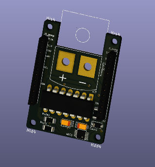

# Global_Val_Sen_Tem
Temperature module Sensor to for Microcontrolles , in the scope of Syracuza proyect. 
Features:
<ul>up
<li> Analog Outoput,</li>
<li> Digital Output via I2C BUS,</li>
<li> + 3 Analog Inputs to High Presicion ADC,</li>
<li> from -80°C to 1400° (optimized for 0°C to 340°C),</li>
<li> Isoated transitor alarm, </li>
<li> Cold point compensation </li>
<li> Compatible with K-type termocouples.</li>
<ul>

Side 4 of a Global Var sensor. 
  
Next commitment: BOM, assembly
